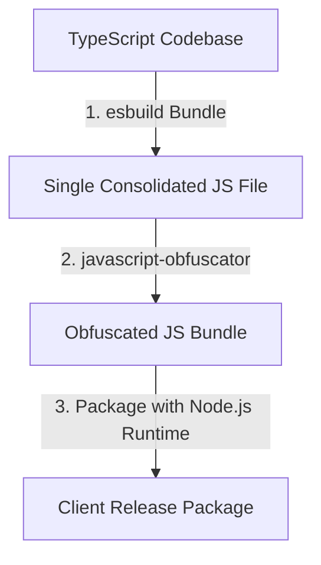

# Guide: Protecting & Delivering Playwright + TypeScript Applications

This guide provides a comprehensive framework for compiling, securing, and packaging **any Playwright + TypeScript application** for client delivery. It covers intellectual property (IP) protection, compilation pipelines, and a comparison of deployment methods.

---

## The Production Protection Pipeline

When delivering a commercial product to a client, you want to protect your core algorithms, selectors, and credentials while ensuring the client can run the automation without installing development tools.



### 1. Code Bundling (esbuild)
Compiles and merges all TypeScript source files (`src/**/*.ts`, `runner.ts`) into a single output file (e.g., `dist/runner.js`).
*   **IP Protection**: Consolidates the code, completely hiding the internal file structure and class directories.
*   **Module Exclusion**: Third-party dependencies (like `playwright`, `openai`, `dotenv`) should be marked as **external** so that the client installs them locally. This avoids packaging native Node modules which are platform-dependent.

### 2. Code Obfuscation (javascript-obfuscator)
The consolidated JavaScript bundle is scrambled to make reverse-engineering practically impossible.
*   **Mangling**: Variables, class names, functions, and parameters are renamed to anonymous hexadecimal characters (e.g., `_0x20a1e5`, `_0x833a4e`).
*   **Playwright Caveat (String Arrays)**: Playwright serializes functions passed to `page.evaluate()` into strings and sends them to the browser sandbox. If string arrays are enabled, the obfuscator extracts all string literals into a global Node-level lookup function, which throws a `ReferenceError` in the browser. 
    > [!IMPORTANT]
    > Always set `--string-array false` when obfuscating Playwright files to keep strings inline and preserve browser evaluations.

---

## Packaging Methods: Single Executable vs. Portable Node

To run the application, the client needs the Node.js runtime. There are two primary ways to deliver Node.js with your code:

### Method A: Single Executable Binary (pkg or Node.js SEA)
This method packages the Node.js engine and your JavaScript code into a single executable binary (e.g., `app.exe`).

#### Critical Issues with Playwright in Binary Compilations:
1.  **Virtual Filesystem Mismatches**: Compilers like `pkg` use a virtual filesystem (`/snapshot/`) to map files. Playwright relies on finding browser drivers, visual frameworks, and scripts inside the physical `node_modules` directory. Since this path is virtualized inside the `.exe`, Playwright cannot locate the browsers or drivers, resulting in instant launch failures.
2.  **Subprocess Spawning Loops**: Playwright spawns separate Node.js child processes to manage browsers and page websockets. When running inside a compiled binary, `process.execPath` points to your custom compiled `.exe` instead of standard `node.exe`. When Playwright tries to spin up a driver, it executes your compiled binary again, creating an infinite loop of executing the main app.
3.  **Cross-Platform Bloat**: Binaries are strictly platform-dependent (you must build separately for Windows, macOS, and Linux), and they do not embed browser executables easily.
4.  **Browser Evaluation & Serialization Failures**: Binary compilers (like `pkg`) encapsulate your files inside a virtual snapshot directory (`/snapshot/`). If your Playwright scripts utilize `page.evaluate()` and attempt to fetch assets, load local client scripts, or run code that is scrambled by an outer-scope compiler obfuscator, the browser context will throw immediate `ReferenceError` or permission-denied crashes. This is because the browser runs inside its own system sandbox and has no access to files packed inside the `.exe`'s virtual snapshot filesystem.

---

### Method B: Portable Node.js (Highly Recommended)
Instead of compiling a binary, you package a **portable Node.js runtime** inside your release folder. The launch script executes your obfuscated code using this local runtime.

```text
out/
├── bin/                           # Standalone Portable Node.js directory
│   ├── node.exe                   # Local Node.js engine
│   ├── npm.cmd                    # Local NPM CLI
│   └── ...
├── dist/                          # Obfuscated codebase
│   └── runner.js                  # Single bundled JavaScript file
├── Testcase/                      # Client assets (JSON/YAML tests)
├── package.json                   # Production package definition
├── run.bat                        # Double-click script for Windows
└── run.sh                         # Run script for macOS/Linux
```

#### Why Portable Node.js is 100% Compatible with Playwright:
*   **Native Execution**: It uses the standard Node.js engine, meaning Playwright can spawn child processes and locate local browser directories without path translation issues.
*   **Zero Installation**: The client does not need to install Node.js globally on their machine. The application runs entirely within its own directory.
*   **Perfect Obfuscation**: The client still has no access to your source code since only the scrambled `dist/runner.js` is distributed.

---

## The Client Release (out/) Structure

The release script compiles and copies only the necessary assets into the ignored **`out/`** folder:

```text
out/
├── dist/                          # Pre-compiled, obfuscated production build
│   └── runner.js                  # Single encrypted file (contains the whole codebase)
├── Testcase/                      # Target automation test cases
│   └── ZeissTestcase.json
├── .env.example                   # Environment credentials template
├── config.json                    # General execution config settings
├── package.json                   # Minimal package definitions for production dependencies
├── package-lock.json              # Version pinning for stability
├── README.md                      # Setup and launch guide for the client
├── run.bat                        # Double-click setup & execution script for Windows
└── run.sh                         # Execution terminal script for macOS / Linux
```

### Assets Excluded from Release
To ensure your IP is safe and the package is compact, the following files are **automatically excluded**:
*   `src/` (Original TypeScript files)
*   `runner.ts` (Original entry point)
*   `tsconfig.json` (TypeScript compilation config)
*   `scripts/` (Build and packaging helper scripts)
*   `node_modules/` (Re-created on the client machine via `npm install`)
*   `.git/` (Git repository histories)
*   `logs/` and `reports/` (Local debugging logs and visual outputs)

---

## Step-by-Step Delivery Setup

Here is how to set up the build and packaging scripts for a Playwright + TypeScript project.

### 1. Build and Obfuscate Scripts
Install the required tools as developer dependencies:
```bash
npm install --save-dev esbuild javascript-obfuscator
```

Configure the `"build"` commands in your `package.json` script section:
```json
"scripts": {
  "build": "node -e \"const fs = require('fs'); fs.rmSync('dist', {recursive: true, force: true});\" && esbuild runner.ts --bundle --platform=node --target=node18 --external:playwright --external:openai --external:dotenv --outfile=dist/runner.js && javascript-obfuscator dist/runner.js --output dist/runner.js --compact true --self-defending false --string-array false",
  "build:release": "npm run build && node scripts/build-release.js",
  "start": "node dist/runner.js"
}
```

### 2. Automated Release Assembler (scripts/build-release.js)
Create a build script that automates cleaning, copying compiled JS, configuration files, and generating clean templates:

```javascript
const fs = require('fs');
const path = require('path');

function copyDirSync(src, dest) {
  fs.mkdirSync(dest, { recursive: true });
  fs.readdirSync(src, { withFileTypes: true }).forEach(entry => {
    const srcPath = path.join(src, entry.name);
    const destPath = path.join(dest, entry.name);
    entry.isDirectory() ? copyDirSync(srcPath, destPath) : fs.copyFileSync(srcPath, destPath);
  });
}

const rootDir = path.resolve(__dirname, '..');
const releaseDir = path.join(rootDir, 'out');

// Clean and create release directory
if (fs.existsSync(releaseDir)) fs.rmSync(releaseDir, { recursive: true, force: true });
fs.mkdirSync(releaseDir);

// Copy compiled code and assets
copyDirSync(path.join(rootDir, 'dist'), path.join(releaseDir, 'dist'));
copyDirSync(path.join(rootDir, 'Testcase'), path.join(releaseDir, 'Testcase'));
fs.copyFileSync(path.join(rootDir, 'config.json'), path.join(releaseDir, 'config.json'));
fs.copyFileSync(path.join(rootDir, 'package.json'), path.join(releaseDir, 'package.json'));
fs.copyFileSync(path.join(rootDir, 'package-lock.json'), path.join(releaseDir, 'package-lock.json'));

// Generate clean environment template
const envTemplate = `AI_PROVIDER=gemini\nGEMINI_API_KEY=your-api-key-here\nPORT=3000\n`;
fs.writeFileSync(path.join(releaseDir, '.env.example'), envTemplate);
```

### 3. Setup Portable Node.js inside the Release Folder
To eliminate Node.js as a prerequisite on the client machine:

1. Download the standalone pre-built binaries (ZIP/TAR) for Node.js from the official [Prebuilt Binaries Portal](https://nodejs.org/en/download/prebuilt-binaries).
2. Extract the archive.
3. Move the extracted files into the `out/bin/` folder.
4. Update the **`out/run.bat`** (Windows Launcher) to run using the local Node engine:

```bat
@echo off
echo ==========================================================
echo           reLOCATE.AI - Client Runner
echo ==========================================================
echo.

:: Check for .env file and generate one if missing
if not exist .env (
    echo [WARNING] .env file not found.
    echo Creating .env file from .env.example template.
    echo Please configure your API keys in the .env file and run this script again.
    copy .env.example .env
    pause
    exit /b 1
)

echo [1/2] Installing production dependencies locally...
call .\bin\npm.cmd install --omit=dev
if %errorlevel% neq 0 (
    echo [ERROR] npm install failed.
    pause
    exit /b %errorlevel%
)

echo.
echo [2/2] Running the application...
call .\bin\node.exe dist\runner.js
pause
```

---

## Summary of Delivery Execution
To prepare the package for the client:
1. Run `npm run build:release`.
2. Extract the portable Node.js binaries into `out/bin/`.
3. Compress the `out/` folder into a single **`.zip`** archive.
4. Deliver the `.zip` archive to the client.
