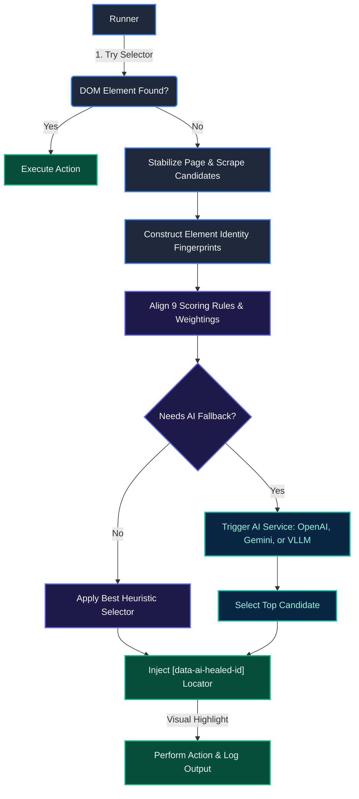

# reLOCATE.AI (Intelligent Element Recovery Engine)

**reLOCATE.AI** is an AI-powered intelligent element recovery engine for web UI automation built on TypeScript. When a UI element locator breaks due to DOM mutations, dynamic text updates, or design changes, the system extracts runtime candidate elements, scores them using a structured rule engine, and falls back to advanced LLMs (OpenAI/Gemini) to dynamically heal the locator.

---

## Key Features

*   **Multi-Dimensional Fingerprinting & AI Recovery**
    *   Models target elements using an advanced **8-dimensional Identity Model** (Semantics, Functional, Behavioral, Ancestry, Spatial, Geometry, Visual Contour, and Grid coordinates) instead of fragile CSS selectors.
    *   Integrates a hybrid scoring engine with a structured LLM reasoning layer.
*   **Plug-and-Play Multi-LLM & Self-Hosted Support**
    *   Designed for strict **Data Safety & Privacy**: Supports **small, self-hosted LLMs** running locally or in private cloud instances (via **vLLM / Qwen 2.5**), ensuring sensitive test execution data remains inside your own infrastructure.
    *   Also includes zero-dependency cloud integrations for **OpenAI (GPT-4o)** and **Google Gemini (Gemini 2.5 Flash)**.
    *   Toggle between self-hosted and cloud options instantly via `.env` configuration.
*   **Shadow-DOM & Slot Piercing**
    *   Extracts candidates recursively across shadow boundaries.
    *   Matches container host tags (e.g., matching target tags to `ShadowDomHostArray` tags like `zui-select-v3-17`).
*   **Dynamic Value & Dropdown Healing**
    *   Special prompt instructions to properly align selectors where the runtime label reflects a changed dynamic selection (e.g., matching `"Today's patients"` to `"All patients"`).
*   **Invisible & Lazy-Loaded Element Bypass**
    *   Automatically preserves target tags (like `IMG`) even if they evaluate to zero-width or `opacity: 0` during DOM scraping, allowing delayed resources to be properly healed.
*   **Animation & Layout Shift Retry Engine**
    *   Catches `"Element is not visible"` or `"detached"` errors immediately during action execution.
    *   Waits for layout stabilization and restarts the healing process seamlessly.
*   **`display: contents` Element Support**
    *   Retains layout-transparent elements (custom buttons, wrappers) in the candidate pool so internal interactive text is never lost.
*   **Advanced Visual Similarity Penalties**
    *   Heavily penalizes candidates that are massively larger than the original target (e.g., 5x or 10x area difference).
    *   Prevents layout containers from falsely matching button edge maps.
*   **Live Visual Feedback**
    *   Draws temporary highlight bounding boxes around target elements on the screen before performing actions.

---

## System Architecture

For a simple-to-understand walkthrough of the decision engine flows, visual diagrams, and scoring pipelines, check out the [Architecture & Decision Flow Guide](file:///c:/Users/shaam/Desktop/AIElementIdentification/docs/project-architecture.md).



1.  **Test Runner (`src/runner/test-runner.ts`)**: Loads JSON testcases, executes standard operations, draws overlay borders, validates healed actionability, and maintains run metrics.
2.  **Candidate Finder (`src/runner/candidate-finder.ts`)**: Recursively crawls light DOM and shadow roots. Evaluates bounding boxes, computes accessibility properties, matches interaction states, and stamps each element with a unique `data-ai-healed-id` attribute.
3.  **Scoring Engine (`src/scoring/scoring.engine.ts`)**: Weights candidates based on multiple rules:
    *   `ObjectNameRule` (Weight 30 — object name / accessibility text match)
    *   `LabelTextRule` (Weight 15 — associated label text match)
    *   `RoleRule` (Weight 15 — HTML tag / ARIA role match)
    *   `AncestorPathRule` (Weight 15 — LCS order-aware matching of shadow host chain + ancestor tag path)
    *   `NearbyTextRule` (Weight 5 — sibling & nearby text match)
    *   `ParentContextRule` (Weight 10 — direct parent tag & ID match)
    *   `DomStructureRule` (Weight 5 — DOM tree depth & index matching)
    *   `ClassNameRule` (Weight 10 — CSS class names matching)
    *   `VisualSimilarityRule` (Weight 20 — visual similarity crop matching)
4.  **AI Providers (`src/ai/`)**: Formats payloads and requests LLMs using JSON schemas to guarantee return types (`candidateId`, `confidence`, `reason`).

---

## Configuration

Create a `.env` file in the project root:

```env
OPENAI_API_KEY=sk-proj-YourOpenAiKeyHere...
GEMINI_API_KEY=AIzaSyYourGeminiKeyHere...

# Choose the active AI service: 'openai', 'gemini', or 'vllm'
AI_PROVIDER=gemini

# Optionals / Model Customization
PORT=3000
GEMINI_MODEL=gemini-2.5-flash

# vLLM / Qwen 2.5 Config (Required if AI_PROVIDER=vllm)
VLLM_BASE_URL=http://<YOUR_EC2_IP>:8000/v1
VLLM_MODEL_NAME=Qwen/Qwen2.5-14B-Instruct
VLLM_API_KEY=dummy-key
```

---

## Usage

### Install Dependencies
```bash
npm install
```

### Run Testcase
Execute the test runner on the target application:
```bash
npm start
```

### Run Simulation Mode
Runs with mock corrupted locators (e.g. login form elements) to demonstrate automatic locator healing:
```bash
npm run simulate
```

---

## Diagnostic Logs

A detailed log is generated under `logs/healing-debug-YYYY-MM-DDTHH-MM-SS.log` for every session. It documents:
*   Initial locator failures and loading delays.
*   The system prompt and formatted candidates list payload sent to the AI.
*   Raw AI output and final healed selector (`[data-ai-healed-id="X"]`).
*   Execution outcome and performance metrics (Confidence levels, execution count, healing accuracy).
