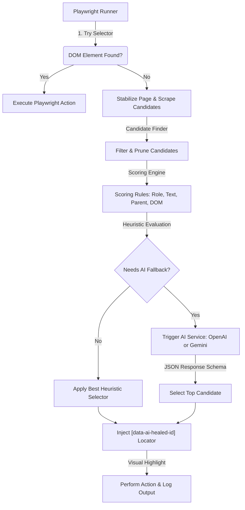

# RelocateAI (Self-Healing Playwright Locator System)

**RelocateAI** is an AI-powered locator healing system for web UI automation built on Playwright and TypeScript. When a UI element locator breaks due to DOM mutations, dynamic text updates, or design changes, the system extracts runtime candidate elements, scores them using a structured rule engine, and falls back to advanced LLMs (OpenAI/Gemini) to dynamically heal the locator.

---

## 🚀 Key Features

*   **Rule-Based Pre-Scoring & AI Recovery**: Multi-tier scoring architecture (Semantic Name, Label Text, Aria Role, Contextual Parent, DOM Depth, Sibling proximity) combined with an LLM reasoning layer.
*   **Plug-and-Play Multi-LLM Support**: Built-in, zero-dependency integration for both **OpenAI (GPT-4o)** and **Google Gemini (Gemini 2.5 Flash)**. Toggle between them instantly using `.env` options.
*   **Shadow-DOM & Slot Piercing**: Extracts candidates recursively across shadow boundaries and matches container host tags (e.g., matching target tags to `ShadowDomHostArray` tags like `zui-select-v3-17`).
*   **Dynamic Dropdown / Value Healing**: Special prompt instructions to properly align selectors where the runtime label reflects a changed dynamic selection (e.g., matching `"Today's patients"` to `"All patients"`).
*   **`display: contents` Element Support**: Retains layout-transparent elements (custom buttons, wrappers) in the candidate pool so internal interactive text is never lost.
*   **Live Visual Feedback**: Draws temporary highlight bounding boxes around target elements on the screen before performing Playwright actions.

---

## 🛠️ System Architecture



1.  **Test Runner (`src/runner/test-runner.ts`)**: Loads JSON testcases, executes standard Playwright operations, draws overlay borders, validates healed actionability, and maintains run metrics.
2.  **Candidate Finder (`src/runner/candidate-finder.ts`)**: Recursively crawls light DOM and shadow roots. Evaluates bounding boxes, computes accessibility properties, matches interaction states, and stamps each element with a unique `data-ai-healed-id` attribute.
3.  **Scoring Engine (`src/scoring/scoring.engine.ts`)**: Weights candidates based on multiple rules:
    *   `ObjectNameRule` (Weight 30)
    *   `LabelTextRule` (Weight 20)
    *   `RoleRule` (Weight 15 — includes shadow host tag boost)
    *   `NearbyTextRule` (Weight 15)
    *   `ParentContextRule` (Weight 10)
    *   `DomStructureRule` (Weight 5)
4.  **AI Providers (`src/ai/`)**: Formats payloads and requests LLMs using JSON schemas to guarantee return types (`candidateId`, `confidence`, `reason`).

---

## ⚙️ Configuration

Create a `.env` file in the project root:

```env
OPENAI_API_KEY=sk-proj-YourOpenAiKeyHere...
GEMINI_API_KEY=AIzaSyYourGeminiKeyHere...

# Choose the active AI service: 'openai' or 'gemini'
AI_PROVIDER=gemini

# Optionals
PORT=3000
GEMINI_MODEL=gemini-2.5-flash
```

---

## 🏃 Usage

### Install Dependencies
```bash
npm install
```

### Run Testcase
Execute the test runner on the target application:
```bash
npm start
```

### Run Simulation Mode
Runs with mock corrupted locators (e.g. login form elements) to demonstrate automatic locator healing:
```bash
npm run simulate
```

---

## 📊 Diagnostic Logs

A detailed log is generated under `logs/healing-debug-YYYY-MM-DDTHH-MM-SS.log` for every session. It documents:
*   Initial locator failures and loading delays.
*   The system prompt and formatted candidates list payload sent to the AI.
*   Raw AI output and final healed selector (`[data-ai-healed-id="X"]`).
*   Execution outcome and performance metrics (Confidence levels, execution count, healing accuracy).
