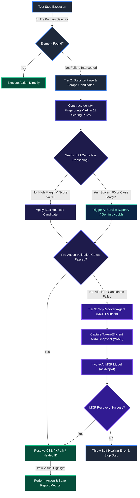

<div align="center">

# reLOCATE.AI
### *Intelligent Self-Healing Element Recovery Engine for Web Automation*

[](https://www.typescriptlang.org/)
[](https://playwright.dev/)
[](https://github.com/shambhoo-narwaria/reLOCATE.AI-Intelligent-Element-Recovery-Engine)
[](LICENSE)

<p align="center">
  <b>reLOCATE.AI</b> intercepts broken UI locators during web test automation and autonomously heals them in real time using multi-dimensional element fingerprinting, dynamic heuristic scoring, and token-efficient AI reasoning.
</p>

[Quick Start](#quick-start) • [Features](#key-features) • [Architecture](#system-architecture--3-tier-recovery) • [Configuration](#configuration) • [Documentation](#documentation-index)

---

</div>

## Table of Contents

- [Key Features](#key-features)
- [System Architecture & 3-Tier Recovery](#system-architecture--3-tier-recovery)
- [The 11-Tier Scoring Engine](#the-11-tier-scoring-engine)
- [Quick Start](#quick-start)
- [Configuration](#configuration)
  - [Environment Variables (`.env`)](#environment-variables-env)
  - [Engine Configuration (`config.json`)](#engine-configuration-configjson)
- [Interactive HTML Reports & Diagnostics](#interactive-html-reports--diagnostics)
- [Programmatic SDK Integration](#programmatic-sdk-integration)
- [Documentation Index](#documentation-index)
- [License](#license)

---

## Key Features

<table width="100%">
  <tr>
    <td width="50%">
      <h3>Tier 3 Pure MCP Recovery Agent</h3>
      <p>Executes an ultra-lightweight, single-run MCP fallback consuming native <code>ariaSnapshot()</code> YAML accessibility trees. Cuts token usage to under <b>500 tokens</b> (vs 30,000+ raw DOM tokens).</p>
    </td>
    <td width="50%">
      <h3>8-Dimensional Identity Model</h3>
      <p>Fingerprints elements using Semantics, Functional Role, Behavioral Traits, Ancestry Path, Spatial Context, 2D Box Geometry, Visual Contours, and Grid Coordinates instead of fragile static selectors.</p>
    </td>
  </tr>
  <tr>
    <td width="50%">
      <h3>Enterprise Data Safety & Local LLMs</h3>
      <p>Supports self-hosted <b>vLLM</b> running local models like <code>Qwen2.5-Coder-7B/14B</code>. Sensitive test data never leaves your infrastructure.</p>
    </td>
    <td width="50%">
      <h3>Shadow-DOM & Slot Piercing</h3>
      <p>Recursively traverses shadow boundaries and projects <code>&lt;slot&gt;</code> elements, resolving custom web-components (e.g. <code>zui-select-v3-17</code>) effortlessly.</p>
    </td>
  </tr>
  <tr>
    <td width="50%">
      <h3>Dynamic Dropdown & Value Healing</h3>
      <p>Handles dynamic UI updates where runtime trigger copy changes to reflect selected state (e.g. matching recorded <code>"Today's patients"</code> to <code>"All patients"</code>).</p>
    </td>
    <td width="50%">
      <h3>Pre-Action Safety Validation Gates</h3>
      <p>Dual-stage <b>Semantic</b> (Levenshtein overlap ≥ 25%) and <b>Visual</b> (Jaccard edge contour match ≥ 15%) validation prevents accidental clicks on wrong elements.</p>
    </td>
  </tr>
  <tr>
    <td width="50%">
      <h3>Interactive HTML Execution Reports</h3>
      <p>Generates detailed visual reports complete with step screenshots, candidate score tables, AI confidence ratings, and visual highlight overlays.</p>
    </td>
    <td width="50%">
      <h3>Live Bounding Box Feedback</h3>
      <p>Draws real-time visual highlight bounding boxes directly on the active browser viewport before performing clicks or text fills.</p>
    </td>
  </tr>
</table>

---

## System Architecture & 3-Tier Recovery

**reLOCATE.AI** operates as an intelligent middle-layer orchestrator. On locator failure, it routes recovery through a progressive 3-tiered architecture:


```mermaid
graph TD
    %% Custom Styling
    classDef runner fill:#1e293b,stroke:#3b82f6,stroke-width:2px,color:#f8fafc;
    classDef scoring fill:#1e1b4b,stroke:#6366f1,stroke-width:2px,color:#f8fafc;
    classDef ai fill:#0b2545,stroke:#00c9a7,stroke-width:2px,color:#8efcd4;
    classDef mcp fill:#311b92,stroke:#8b5cf6,stroke-width:2px,color:#f8fafc;
    classDef action fill:#064e3b,stroke:#10b981,stroke-width:2px,color:#ecfdf5;

    A[Test Step Execution]:::runner -->|1. Try Primary Selector| B{Element Found?}:::runner
    B -->|Yes| C[Execute Action Directly]:::action
    B -->|No: Failure Intercepted| D[Tier 2: Stabilize Page & Scrape Candidates]:::runner
    D --> E[Construct Identity Fingerprints & Align 11 Scoring Rules]:::scoring
    E --> F{Needs LLM Candidate Reasoning?}:::scoring
    F -->|No: High Margin & Score >= 90| G[Apply Best Heuristic Candidate]:::scoring
    F -->|Yes: Score < 90 or Close Margin| H["Trigger AI Service (OpenAI / Gemini / vLLM)"]:::ai
    G --> I{Pre-Action Validation Gates Passed?}:::scoring
    H --> I
    I -->|Yes| J[Resolve CSS / XPath / Healed ID]:::action
    I -->|No: All Tier 2 Candidates Failed| K["Tier 3: McpRecoveryAgent (MCP Fallback)"]:::mcp
    K --> L["Capture Token-Efficient ARIA Snapshot (YAML)"]:::mcp
    L --> M["Invoke AI MCP Model (askMcpAI)"]:::mcp
    M --> N{MCP Recovery Success?}:::mcp
    N -->|Yes| J
    N -->|No| O[Throw Self-Healing Error & Stop Step]:::runner
    J -->|Draw Visual Highlight| P[Perform Action & Save Report Metrics]:::action
```

---

## The 11-Tier Scoring Engine

Before calling LLMs, candidate elements are ranked across **11 mathematical rules** combining continuous distance metrics and structural graph topology:

| Metric Rule | Weight | Primary Matching Criteria |
| :--- | :---: | :--- |
| **`ObjectNameRule`** | **30** | Wagner-Fischer Normalized Levenshtein Edit Distance on accessibility name & display copy. |
| **`VisualSimilarityRule`** | **20** | Weighted Jaccard IoU on 2D Box-Blurred Edge Contours with strict area penalties (-1.0 for 10x size mismatch). |
| **`LabelTextRule`** | **15** | Levenshtein ratio matching associated `<label>` wrappers and `aria-labelledby` targets. |
| **`RoleRule`** | **15** | String equality matching HTML5 tags and WAI-ARIA roles with Shadow Host Tag bonuses (+80%). |
| **`AncestorPathRule`** | **15** | Longest Common Subsequence (LCS) sequence alignment on shadow host chains and DOM ancestor paths. |
| **`ParentContextRule`** | **10** | String matching on direct parent tag names and parent element IDs. |
| **`ClassNameRule`** | **10** | Jaccard Token Index similarity over CSS class arrays, filtering out framework dynamic hashes. |
| **`NearbyTextRule`** | **10** | Substring intersect matrix matching sibling and layout neighbor landmark strings. |
| **`CssSelectorRule`** | **10** | LCS path similarity on parsed CSS selector combinators. |
| **`DomStructureRule`** | **5** | Relative DOM depth and parent sibling index difference ratio. |
| **`HorizontalProximityRule`**| **5** | Coordinate proximity tiebreaker for elements arranged in grid columns. |

---

## Quick Start

### 1. Prerequisites & Installation

Clone the repository and install dependencies:

```bash
git clone https://github.com/shambhoo-narwaria/reLOCATE.AI-Intelligent-Element-Recovery-Engine.git
cd reLOCATE.AI-Intelligent-Element-Recovery-Engine
npm install
```
*(Note: `postinstall` automatically fetches standard Chromium browser binaries via Playwright).*

If browser binaries are missing, run manually:
```bash
npx playwright install chromium
```

---

### 2. Running Testcases

**Development Mode (Direct TypeScript)**
```bash
npm run start:dev
```

**Production Mode (Bundled Release Execution)**
```bash
npm run build
npm start
```

**Packaging Standalone Release**
```bash
npm run build:release
```

---

## Configuration

### Environment Variables (`.env`)
Create a `.env` file in the project root to configure your AI provider:

```env
# Active AI provider: 'gemini', 'openai', 'vllm', or 'openrouter'
AI_PROVIDER=gemini

# API Keys
GEMINI_API_KEY=AIzaSyYourGeminiKeyHere...
OPENAI_API_KEY=sk-proj-YourOpenAiKeyHere...
OPENROUTER_API_KEY=sk-or-v1-YourOpenRouterKeyHere...

# Model Options
GEMINI_MODEL=gemini-2.5-flash
OPENAI_MODEL=gpt-4o-mini

# Self-Hosted vLLM / Qwen 2.5 Config (Required if AI_PROVIDER=vllm)
VLLM_BASE_URL=http://<YOUR_EC2_IP>:8000/v1
VLLM_MODEL_NAME=Qwen/Qwen2.5-14B-Instruct
VLLM_API_KEY=dummy-key
```

### Engine Configuration (`config.json`)
Manage engine fallback toggles and debug parameters:

```json
{
  "USE_AI_MODEL": true,
  "LOG_CANDIDATES": true,
  "AI_MAX_CANDIDATES": 10,
  "ENABLE_MCP_FALLBACK": true,
  "FORCE_MCP_STEP": ""
}
```

| Parameter | Type | Description |
| :--- | :--- | :--- |
| `ENABLE_MCP_FALLBACK` | `boolean` | Global toggle to enable or disable Tier 3 Pure MCP accessibility recovery. |
| `FORCE_MCP_STEP` | `string` \| `number` | Debug option to force direct Tier 3 MCP recovery for a step (e.g. `"1"`, `"16"`, or `"all"`). |
| `AI_MAX_CANDIDATES` | `number` | Context pool pruning cap (defaults to top 10 candidates). |

---

## Interactive HTML Reports & Diagnostics

After every run, **reLOCATE.AI** generates an interactive HTML report under `.workspace/reports/Execution-Report-YYYY-MM-DD_HH-MM-SS/report.html`:

- **`✨ Healed by AI (MCP)`** — Healed via Tier 3 Pure MCP YAML accessibility snapshots.
- **`✨ Healed by AI`** — Healed via Tier 2 LLM Candidate reasoning.
- **`Healed`** — Healed via Tier 2 local Rule Engine heuristics.

### Diagnostic Logs
Detailed step-by-step reasoning logs are recorded in `.workspace/logs/relocate-debug.log`, documenting candidate scores, system prompts, formatted payloads, and MCP YAML accessibility snapshots.

---

## Programmatic SDK Integration

**reLOCATE.AI** is designed as a **Pure Standalone Recovery Engine SDK**. It does not alter your existing runner logic or perform classical trials on its own. 

When your existing automation engine encounters a locator failure, it calls `relocator.relocateElement(page, step)` to recover and return the healed Playwright `Locator` object. Your runner then executes the action (`.click()`, `.fill()`) on the returned `Locator`.

```typescript
import { Page, Locator } from 'playwright';
import { Relocator } from 'relocate-ai';

// 1. Initialize the recovery engine once
const relocator = new Relocator({ aiProvider: 'gemini' });

/**
 * Example Hook inside an existing runner / Page Object class
 */
export async function getElementWithRecovery(
  page: Page,
  step: { selector: string; objectName?: string; tagName?: string; labelText?: string; action: string }
): Promise<Locator> {
  let locator: Locator;

  try {
    // 1. Existing runner tries its classical selector first
    locator = page.locator(step.selector).first();
    await locator.waitFor({ state: 'visible', timeout: 2000 });
  } catch (error) {
    // 2. All classical attempts failed -> Call reLOCATE.AI Recovery Engine
    console.warn(`[Runner] Selector "${step.selector}" failed. Invoking reLOCATE.AI Recovery Engine...`);

    locator = await relocator.relocateElement(page, {
      LocCssSelector: step.selector,
      ObjectName: step.objectName || step.selector,
      LocTagName: step.tagName || 'BUTTON',
      labelText: step.labelText,
      Action: step.action // 'Click', 'Enter', 'Select'
    });
  }

  // 3. Return resolved Locator back to runner to execute action (.click / .fill)
  return locator;
}
```

---

## Documentation Index

Deep dive into the underlying design, mathematical models, and payload specifications:

- **[Getting Started & SDK Guide](docs/getting-started.md)** — Integration walkthrough and parameter reference.
- **[Architecture & Decision Flow](docs/architecture.md)** — Detailed flowcharts, candidate pruning, and safety gates.
- **[Technical Mechanics & Engine Internals](docs/technical-mechanics.md)** — Candidate finder, shadow-DOM recursion, and locator resolution.
- **[AI Payload & JSON Schemas](docs/ai-payload-schemas.md)** — Request structures, prompt engineering, and response contracts.
- **[Deployment & Release Guide](docs/deployment-guide.md)** — Build packaging, obfuscation, and release distribution.

---

## License

Distributed under the **MIT License**. See [LICENSE](LICENSE) for details.
