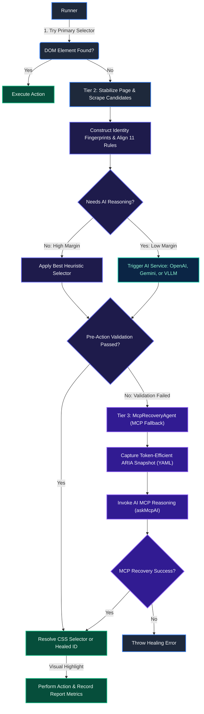

# reLOCATE.AI (Intelligent Element Recovery Engine)

**reLOCATE.AI** is an AI-powered intelligent element recovery engine for web UI automation built on TypeScript. When a UI element locator breaks due to DOM mutations, dynamic text updates, or design changes, the system extracts runtime candidate elements, scores them using a structured rule engine, and falls back to advanced LLMs (OpenAI/Gemini) to dynamically heal the locator.

---

## Key Features

*   **Tier 3 Pure MCP Recovery Agent**
    *   Executes as an ultra-lightweight, single-run fallback (`McpRecoveryAgent`) when Tier 2 heuristic and candidate AI cycles fail pre-action validation.
    *   Consumes native `locator('body').ariaSnapshot()` YAML accessibility trees for maximum token efficiency (<500 tokens total vs 30,000+ raw DOM tokens).
    *   Temporarily suppresses system UI overlays (`__ai-healing-status-overlay__`) via `aria-hidden` prior to snapshot capture to prevent accessibility tree pollution.
    *   Selective visual fallback: automatically attaches a compressed JPEG base64 screenshot if the accessibility tree is empty or insufficient.
*   **Multi-Dimensional Fingerprinting & AI Recovery**
    *   Models target elements using an advanced **8-dimensional Identity Model** (Semantics, Functional, Behavioral, Ancestry, Spatial, Geometry, Visual Contour, and Grid coordinates) instead of fragile CSS selectors.
    *   Integrates a hybrid scoring engine with a structured LLM reasoning layer.
*   **Plug-and-Play Multi-LLM & Self-Hosted Support**
    *   Designed for strict **Data Safety & Privacy**: Supports **small, self-hosted LLMs** running locally or in private cloud instances (via **vLLM**), ensuring sensitive test execution data remains inside your own infrastructure.
    *   **Recommended Models for DOM/Locator Reasoning**:
        *   *Self-Hosted (Recommended)*: **`Qwen2.5-Coder-7B-Instruct`** or **`Qwen2.5-Coder-14B-Instruct`** (7B/14B models run easily on consumer GPUs and perform exceptionally well here because our pruning pipeline limits the context to just the top 10 candidates).
        *   *OpenAI Cloud*: **`gpt-4o`** or **`gpt-4o-mini`** (high accuracy, structured JSON mode support).
        *   *Google Gemini Cloud*: **`gemini-2.5-flash`** or **`gemini-2.5-pro`** (very low latency, native generation schemas).
    *   Toggle between self-hosted and cloud options instantly via `.env` configuration.
*   **Shadow-DOM & Slot Piercing**
    *   Extracts candidates recursively across shadow boundaries.
    *   Matches container host tags (e.g., matching target tags to `ShadowDomHostArray` tags like `zui-select-v3-17`).
*   **Dynamic Value & Dropdown Healing**
    *   Special prompt instructions to properly align selectors where the runtime label reflects a changed dynamic selection (e.g., matching `"Today's patients"` to `"All patients"`).
*   **Invisible & Lazy-Loaded Element Bypass**
    *   Automatically preserves target tags (like `IMG`) even if they evaluate to zero-width or `opacity: 0` during DOM scraping, allowing delayed resources to be properly healed.
*   **Animation & Layout Shift Retry Engine**
    *   Catches `"Element is not visible"` or `"detached"` errors immediately during action execution.
    *   Waits for layout stabilization and restarts the healing process seamlessly.
*   **`display: contents` Element Support**
    *   Retains layout-transparent elements (custom buttons, wrappers) in the candidate pool so internal interactive text is never lost.
*   **Advanced Visual Similarity Penalties**
    *   Heavily penalizes candidates that are massively larger than the original target (e.g., 5x or 10x area difference).
    *   Prevents layout containers from falsely matching button edge maps.
*   **Live Visual Feedback**
    *   Draws temporary highlight bounding boxes around target elements on the screen before performing actions.

---

## System Architecture

For a simple-to-understand walkthrough of the decision engine flows, visual diagrams, and scoring pipelines, check out the [Architecture & Decision Flow Guide](file:///c:/Users/shaam/Desktop/reLOCATE.AI/docs/project-architecture.md).


```mermaid
graph TD
    %% Custom Theme Styling
    classDef runner fill:#1e293b,stroke:#3b82f6,stroke-width:2px,color:#f8fafc;
    classDef scoring fill:#1e1b4b,stroke:#6366f1,stroke-width:2px,color:#f8fafc;
    classDef ai fill:#0b2545,stroke:#00c9a7,stroke-width:2px,color:#8efcd4;
    classDef mcp fill:#311b92,stroke:#8b5cf6,stroke-width:2px,color:#f8fafc;
    classDef action fill:#064e3b,stroke:#10b981,stroke-width:2px,color:#ecfdf5;

    A[Runner]:::runner -->|1. Try Primary Selector| B(DOM Element Found?):::runner
    B -->|Yes| C[Execute Action]:::action
    B -->|No| D[Tier 2: Stabilize Page & Scrape Candidates]:::runner
    D --> E[Construct Identity Fingerprints & Align 11 Rules]:::scoring
    E --> F{Needs AI Reasoning?}:::scoring
    F -->|No: High Margin| G[Apply Best Heuristic Selector]:::scoring
    F -->|Yes: Low Margin| H["Trigger AI Service: OpenAI, Gemini, or VLLM"]:::ai
    G --> I{Pre-Action Validation Passed?}:::scoring
    H --> I
    I -->|Yes| J[Resolve CSS Selector or Healed ID]:::action
    I -->|No: Validation Failed| K["Tier 3: McpRecoveryAgent (MCP Fallback)"]:::mcp
    K --> L["Capture Token-Efficient ARIA Snapshot (YAML)"]:::mcp
    L --> M["Invoke AI MCP Reasoning (askMcpAI)"]:::mcp
    M --> N{MCP Recovery Success?}:::mcp
    N -->|Yes| J
    N -->|No| O[Throw Healing Error]:::runner
    J -->|Visual Highlight| P[Perform Action & Record Report Metrics]:::action
```

1.  **Test Runner (`src/runner/test-runner.ts`)**: Loads JSON testcases, executes standard operations, draws overlay borders, validates healed actionability, and maintains run metrics.
2.  **Candidate Finder (`src/runner/candidate-finder.ts`)**: Recursively crawls light DOM and shadow roots. Evaluates bounding boxes, computes accessibility properties, matches interaction states, and stamps each element with a unique `data-ai-healed-id` attribute.
3.  **Scoring Engine (`src/scoring/scoring.engine.ts`)**: Weights candidates based on multiple rules:
    *   `ObjectNameRule` (Weight 30 — object name / accessibility text match)
    *   `LabelTextRule` (Weight 15 — associated label text match)
    *   `RoleRule` (Weight 15 — HTML tag / ARIA role match)
    *   `AncestorPathRule` (Weight 15 — LCS order-aware matching of shadow host chain + ancestor tag path)
    *   `NearbyTextRule` (Weight 10 — sibling & nearby text match)
    *   `ParentContextRule` (Weight 10 — direct parent tag & ID match)
    *   `DomStructureRule` (Weight 5 — DOM tree depth & index matching)
    *   `ClassNameRule` (Weight 10 — CSS class names matching)
    *   `VisualSimilarityRule` (Weight 20 — visual similarity crop matching)
    *   `CssSelectorRule` (Weight 10 — CSS selector path similarity matching)
    *   `HorizontalProximityRule` (Weight 5 — horizontal proximity tiebreaker matching)
4.  **LLM Providers (`src/llm-connectors/`)**: Formats payloads and requests LLMs using JSON schemas to guarantee return types (`candidateId`, `confidence`, `reason`). Implements `askMcpAI()` for pure MCP recovery.
5.  **MCP Recovery Agent (`src/mcp/mcp-recovery-agent.ts`)**: Provides token-efficient Tier 3 MCP accessibility tree recovery (`locator('body').ariaSnapshot()`) as a single topmost fallback.

---

## Configuration

### Environment Variables (`.env`)
Create a `.env` file in the project root:

```env
OPENAI_API_KEY=sk-proj-YourOpenAiKeyHere...
GEMINI_API_KEY=AIzaSyYourGeminiKeyHere...

# Choose the active AI service: 'openai', 'gemini', 'vllm', or 'openrouter'
AI_PROVIDER=gemini

# Optionals / Model Customization
PORT=3000
GEMINI_MODEL=gemini-2.5-flash

# vLLM / Qwen 2.5 Config (Required if AI_PROVIDER=vllm)
VLLM_BASE_URL=http://<YOUR_EC2_IP>:8000/v1
VLLM_MODEL_NAME=Qwen/Qwen2.5-14B-Instruct
VLLM_API_KEY=dummy-key
```

### Engine Configuration (`config.json`)
Manage engine behavior and debugging flags via `config.json` in the root directory:

```json
{
  "ENABLE_MCP_FALLBACK": true,
  "FORCE_MCP_STEP": ""
}
```
*   **`ENABLE_MCP_FALLBACK`** (`boolean`): Enables or disables Tier 3 Pure MCP recovery globally.
*   **`FORCE_MCP_STEP`** (`string` | `number`): Debug option to force Tier 3 MCP recovery directly for a specific step (e.g. `"1"`, `"2"`, or `"all"`), bypassing Tier 2 heuristic cycles.

---

## Usage

### 1. Installation & Environment Setup

Clone the repository and install all required Node.js dependencies:
```bash
npm install
```
*(Note: `postinstall` automatically runs `npx playwright install chromium` to fetch necessary Playwright browser binaries).*

If browser binaries are missing, run manually:
```bash
npx playwright install chromium
```

Configure your environment variables by creating a `.env` file in the project root:
```env
# Choose active AI provider: 'gemini', 'openai', or 'vllm'
AI_PROVIDER=gemini
GEMINI_API_KEY=your_gemini_api_key_here
```

---

### 2. Building the Engine

**Standard Build**  
Bundles `runner.ts` and core engines into `.workspace/dist/runner.js` using `esbuild` and applies obfuscation:
```bash
npm run build
```

**Production Release Build**  
Runs the standard build and packages standalone release artifacts under the `.workspace/release/` directory:
```bash
npm run build:release
```

---

### 3. Running the Self-Healing Engine

**Development Mode (Direct TypeScript Execution)**  
Executes `runner.ts` directly with `ts-node` without needing to build first:
```bash
npm run start:dev
```

**Production Mode (Bundled Runner Execution)**  
Executes the pre-compiled production bundle from `.workspace/dist/runner.js`:
```bash
npm start
```

---

### 4. Viewing Execution & Healing Reports

After running testcases, **reLOCATE.AI** automatically compiles a detailed interactive HTML report and diagnostic logs:

*   **Interactive HTML Execution Report**: Open `.workspace/reports/Execution-Report-YYYY-MM-DD_HH-MM-SS/report.html` in any browser to inspect candidate scores, AI confidence levels, visual highlight bounding boxes, and healing metrics. Distinct badges highlight recovery tiers:
    *   `✨ Healed by AI (MCP)` (Purple Gradient): Resolved via Tier 3 Pure MCP accessibility snapshots.
    *   `✨ Healed by AI` (Blue/Purple Gradient): Resolved via Tier 2 LLM Candidate Reasoning.
    *   `Healed` (Green Pill): Resolved via Tier 2 local Rule-Based Heuristics.
*   **Diagnostic Logs**: Detailed runtime step-by-step reasoning logs are saved under `.workspace/logs/relocate-debug.log`.

---

### 5. Integration in External Test Suites (Plug-and-Play Library)

You can import the core element recovery pipeline directly into your existing TypeScript / JavaScript Playwright test frameworks:

```typescript
import { Relocator } from 'relocate-ai';

// 1. Initialize the relocator instance (reads .env automatically)
const relocator = new Relocator({ aiProvider: 'gemini' });

// 2. Perform self-healing element relocation
// If the primary locator (#mutated-login-btn) fails, reLOCATE heals it dynamically
const healedLocator = await relocator.relocateElement(page, {
  LocCssSelector: '#mutated-login-btn',
  ObjectName: 'Login Button',
  Action: 'Click',
  LocTagName: 'BUTTON',
  labelText: 'Sign In'
});

// 3. Execute actions using standard Playwright methods
await healedLocator.click();
```

For a comprehensive guide, parameters, and design details, check out the [RelocateEngine Integration Guide](file:///c:/Users/shaam/Desktop/reLOCATE.AI/docs/getting-started.md).

---

## Diagnostic Logs

A detailed log is generated under `.workspace/logs/healing-debug-YYYY-MM-DDTHH-MM-SS.log` (and mirrored to `relocate-debug.log`) for every session. It documents:
*   Initial locator failures and loading delays.
*   Tier 2 heuristic scores, system prompts, candidate payloads, and LLM reasoning.
*   Tier 3 MCP requests (`logMcpRequest`) including multi-line accessibility tree YAML snapshots and MCP AI responses (`logMcpResponse`).
*   Resolved CSS/XPath or Playwright native locators (e.g. `getByRole`, `getByText`, or `[data-ai-healed-id]`).
*   Execution outcome and performance metrics (Confidence levels, execution count, healing accuracy).
