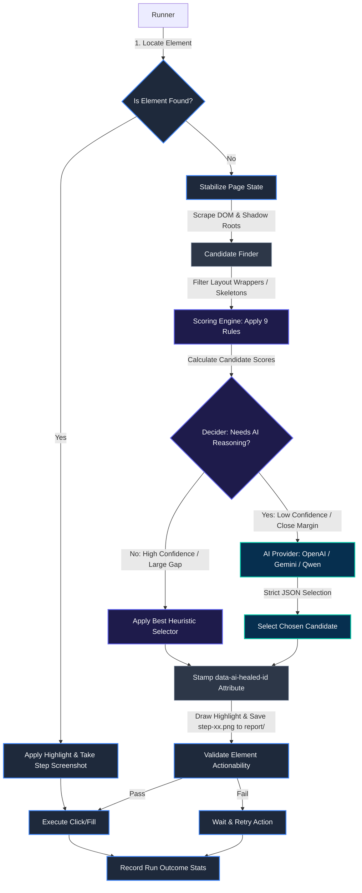
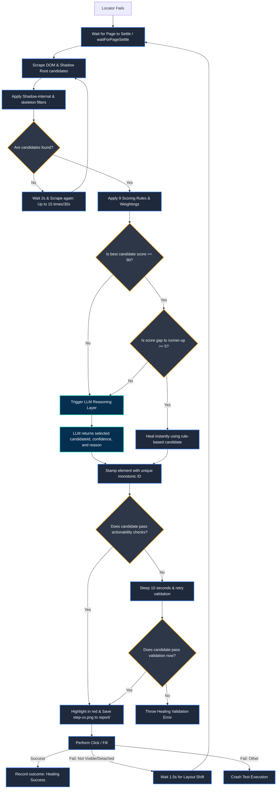
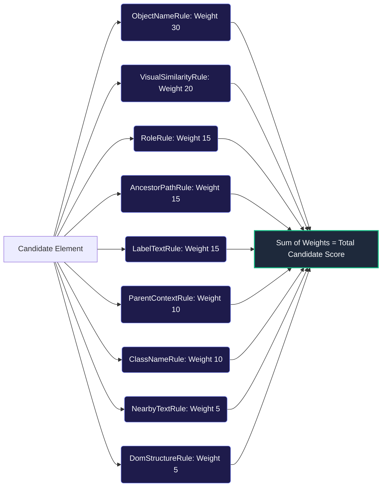
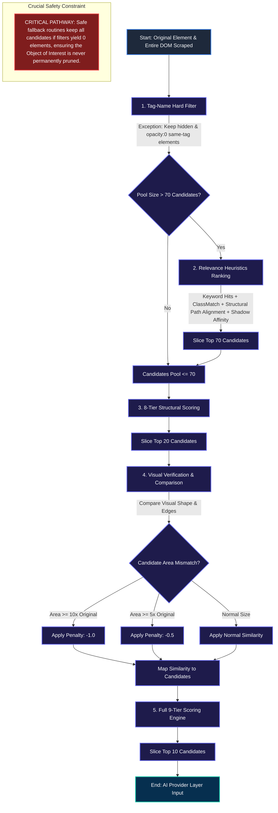

# RelocateAI: Architecture & Decision Flow Guide

This guide explains the full architecture and decision-making logic of **RelocateAI** in a simple, visual, and easy-to-understand format.

---

## 1. High-Level Architecture

RelocateAI operates as a **middle-layer orchestrator** between your script and the web browser. When a script requests an action (like a Click or Fill) on a locator that cannot be found, RelocateAI intercepts the failure and initiates the self-healing cycle.

---

## 2. Detailed Healing Decision Tree

The Orchestrator (`HealingEngine`) uses a hybrid model. It first calculates a **heuristic score** (0 to 100) using lightweight local math rules. If the local rules are highly confident and there is no ambiguity, it avoids calling expensive LLMs.

To handle dynamic, slow-loading Single Page Applications (SPAs) and frameworks, the candidate collection loop retries up to **15 times** (at 2-second intervals, allowing a maximum of **30 seconds**) if zero candidates are detected, ensuring that skeleton loadings have settled.

The flowchart below details the exact logical decisions made during a locator failure, highlighting how step screenshots are recorded:

---

## 3. The 9-Tier Scoring Pipeline

Before any LLM call is made, the **Scoring Engine** evaluates every single candidate element against **9 distinct metrics**. Each metric calculates a score (0.0 to 1.0) which is multiplied by the rule's weight.

### Candidate Pool Pruning (Top 10 Selection)
The orchestrator progressively filters candidate elements through a series of structural, heuristic, and visual stages to prune a raw DOM pool of hundreds down to the **top 10 candidates** (configurable via `AI_MAX_CANDIDATES` in the configuration) before passing them to the AI Reasoning Layer. This progressive pruning drastically reduces token consumption, cuts down API latency/cost, and prevents model confusion. For a detailed breakdown of the complete pruning pipeline, see [Section 4: The Candidate Pruning Pipeline](#4-the-candidate-pruning-pipeline-dom-to-10-candidates).

#### Detailed Breakdown of the 9 Rules

The rules are divided into **Heuristic String & Visual Rules** (which calculate similarity scores based on spatial and semantic dimensions) and **Direct Attribute Matches** (which verify structural alignment and tree geometry).

#### 1. Heuristic String & Visual Rules (Multidimensional Similarity Calculations)

*   **`ObjectNameRule` (Weight: 30)**
    *   **Mechanism**: An advanced textual semantic mapping system that evaluates candidate labels, names, and implicit values against the original element signature using high-precision string-distance vectors.

*   **`VisualSimilarityRule` (Weight: 20)**
    *   **Mechanism**: A sophisticated computer vision engine that generates blurred edge-contour maps and evaluates shape integrity using multi-dimensional visual intersection matrices to ensure pixel-level alignment.

*   **`AncestorPathRule` (Weight: 15)**
    *   **Mechanism**: An advanced structural sequence aligner that analyzes the nested tag lineage and ancestor paths, matching the tree trajectory to reward candidate elements that preserve the deep structural heritage of the original component.

*   **`LabelTextRule` (Weight: 15)**
    *   **Mechanism**: A contextual association resolver that maps and compares associated HTML form labels, ARIA descriptive bindings, and floating labels to correlate accessibility-compliant elements.

*   **`ClassNameRule` (Weight: 10)**
    *   **Mechanism**: A framework-agnostic CSS classifier that strips framework-specific dynamic hashes and matches the core styling signature of elements using advanced token similarity matrices.

*   **`NearbyTextRule` (Weight: 5)**
    *   **Mechanism**: An advanced spatial analysis rule that scans the visual neighborhood (adjacent sibling lines and container contexts) to correlate candidates with the original element's surrounding environment.

---

#### 2. Direct Attribute Matches (Tree Geometry Comparisons)

*   **`RoleRule` (Weight: 15)**
    *   **Mechanism**: An accessibility-level classifier that validates structural tag types and interactive role mappings, including recursive custom component shadow host parsing, to verify functional alignment.

*   **`ParentContextRule` (Weight: 10)**
    *   **Mechanism**: A precise parent node validator that matches direct parent IDs, class tags, and styling signatures to reinforce hierarchy safety.

*   **`DomStructureRule` (Weight: 5)**
    *   **Mechanism**: A tree geometry rule that calculates relative coordinates, position indices, and depth differentials within the document tree to evaluate architectural positioning.

---

## 4. The Candidate Pruning Pipeline (DOM ➔ 10 Candidates)

To prevent sending massive DOM payloads to LLMs (which is slow, expensive, and leads to target element confusion or model hallucinations), **RelocateAI** runs a highly optimized, multi-tier candidate pruning pipeline. This pipeline converts the entire raw DOM (which can contain hundreds or thousands of elements) down to just the **top 10 potential candidates** for the AI reasoning layer.

### Crucial Objective: Retaining the Object of Interest
The most critical requirement of the pruning pipeline is **never to lose the Object of Interest (the target element)**. If the correct element is pruned at any stage, subsequent AI reasoning cannot recover it. Therefore, the pipeline uses safe fallbacks, lenient filters, and context bonuses to protect the target.

### Detailed Pipeline Stages

#### Stage 1: Scrape & Tag-Name Filter
- **Input**: The entire web document and shadow roots.
- **Process**: Keeps only the elements that match the original tag name (`OrigTagName`, e.g., `INPUT`, `BUTTON`, or a custom component like `ZUI-SELECT-V3-17`).
- **Safety Exceptions**: 
  - **Hidden / Opacity 0 Elements**: If an element matches the target tag name, it is kept **even if it is hidden or has opacity: 0** (unlike other elements which are immediately discarded if invisible). This preserves lazy-loaded images, fading modals, or elements temporarily hidden by loading states.
  - **No-Match Fallback**: If zero candidates match the tag name (indicating a total framework/tag redesign), the filter is bypassed entirely to avoid losing the target.

#### Stage 2: Relevance Cap (Pruning to 70 Candidates)
If the candidate pool is still larger than 70 elements, a lightweight keyword and structural matching algorithm ranks and prunes the pool:
1. **Keyword Overlap**: Matches words from `ObjectName`, `NearByText`, and `LocClassName`.
2. **Text Conciseness**: If a candidate contains the target text, it receives an extra bonus if it is a clean match (+30 points for near-exact length) to prevent large layout wrappers from outranking specific child elements.
3. **ClassMatch**: Rewards elements whose CSS classes match the original class structure, which is crucial for unlabeled dynamic icon buttons.
4. **Ancestor Path Alignment**: Compares up to 4 ancestors of the CSS selector to verify the component hierarchy.
5. **Shadow Host Chain Affinity**: Evaluates shadow host overlaps, ensuring that inputs nested inside the correct custom components are kept even if text hits are zero.
- **Result**: The pool is sliced down to the **top 70 candidates** based on their composite score.

#### Stage 3: 8-Tier Structural Scoring (Pruning to 20 Candidates)
- **Process**: The Scoring Engine evaluates candidates using the **8 structural/attribute rules** (excluding the visual rule).
- **Result**: The pool is sorted by score, and the **top 20 candidates** are selected to advance to the next, more expensive stage.

#### Stage 4: Visual Similarity with Area Penalties
- **Process**: The top 20 candidates are scrolled into view sequentially, and compared visually against the original template.
- **Area-Based Penalties**:
  - If the candidate's area is **10 times or more** than the original element: visual similarity score is heavily penalized (-1.0).
  - If the candidate's area is **5 times or more** than the original element: visual similarity score is partially penalized (-0.5).
- **Result**: Highly similar but oversized layout wrappers are heavily penalized. The similarity scores are mapped back to the candidate objects.

#### Stage 5: Final Selection (Top 10 Candidates)
- **Process**: The Scoring Engine compiles the final scores using all **9 rules** (including the visual similarity score calculated in Stage 4).
- **Result**: The candidates are sorted, and the **top 10 candidates** are selected (configurable via `AI_MAX_CANDIDATES`).
- **AI Delivery**: If heuristics are insufficient (margin is low or score is below 90), these final 10 candidates, along with the original element details, are forwarded to the AI provider for strict JSON selection.

---

## 5. Key Components Glossary

| Component Name | Role in the System | Code Location |
| :--- | :--- | :--- |
| **`TestRunner`** | Coordinates execution. It loops over test steps, handles click/fill timeouts, invokes page-settle stabilization, draws highlights, captures step screenshots in the `report/` folder with the target element highlighted, validates actionability, and executes retries. | [`src/runner/test-runner.ts`](file:///c:/Users/shaam/Desktop/AIElementIdentification/src/runner/test-runner.ts) |
| **`CandidateFinder`** | Injected script that climbs shadow root nodes and slot boundaries recursively to find valid interactive targets. Stamps elements with unique monotonic IDs. | [`src/runner/candidate-finder.ts`](file:///c:/Users/shaam/Desktop/AIElementIdentification/src/runner/candidate-finder.ts) |
| **`ScoringEngine`** | The mathematical evaluator. It receives the raw candidate list and processes each candidate through the 9 rule-scoring components. | [`src/scoring/scoring.engine.ts`](file:///c:/Users/shaam/Desktop/AIElementIdentification/src/scoring/scoring.engine.ts) |
| **`HealingEngine`** | The brains. Orchestrates the decision matrix, filters candidates based on tag structure, runs pre-scoring, determines if LLM is required, and requests AI services. | [`src/healing/healing.engine.ts`](file:///c:/Users/shaam/Desktop/AIElementIdentification/src/healing/healing.engine.ts) |
| **`AI Services`** | Connects to standard APIs (OpenAI, Google Gemini, OpenRouter, vLLM) using strict structured output configurations to select the best candidate. | [`src/ai/`](file:///c:/Users/shaam/Desktop/AIElementIdentification/src/ai/) |
| **`ElementValidator`** | Runs actionability tests (`isVisible`, `isEnabled`, `isEditable`) on healed locators to ensure they are clickable before execution proceeds. | [`src/runner/element-validator.ts`](file:///c:/Users/shaam/Desktop/AIElementIdentification/src/runner/element-validator.ts) |
