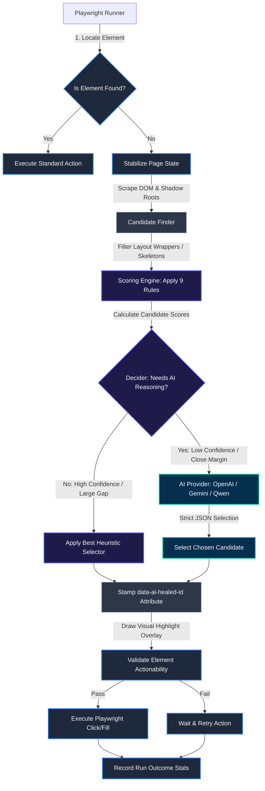
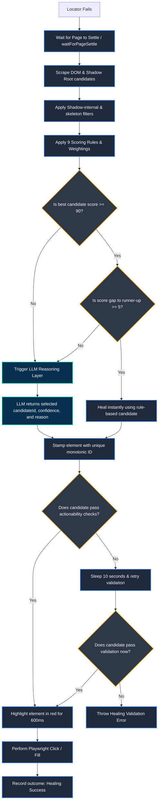
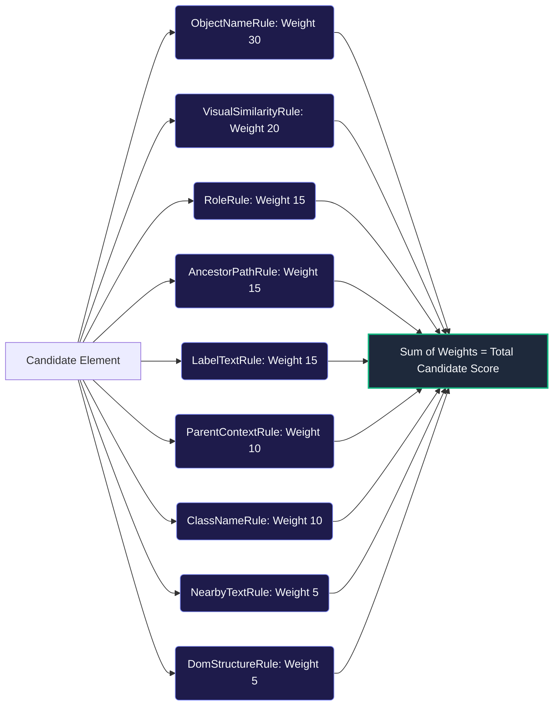

# RelocateAI: Architecture & Decision Flow Guide

This guide explains the full architecture and decision-making logic of **RelocateAI** in a simple, visual, and easy-to-understand format.

---

## 1. High-Level Architecture

RelocateAI operates as a **middle-layer orchestrator** between your Playwright script and the web browser. When a script requests an action (like a Click or Fill) on a locator that cannot be found, RelocateAI intercepts the failure and initiates the self-healing cycle.

---

## 2. Detailed Healing Decision Tree

The Orchestrator (`HealingEngine`) uses a hybrid model. It first calculates a **heuristic score** (0 to 100) using lightweight local math rules. If the local rules are highly confident and there is no ambiguity, it avoids calling expensive LLMs.

The flow chart below details the exact logical decisions made during a locator failure:

---

## 3. The 9-Tier Scoring Pipeline

Before any LLM call is made, the **Scoring Engine** evaluates every single candidate element against **9 distinct metrics**. Each metric calculates a score (0.0 to 1.0) which is multiplied by the rule's weight.

### Candidate Pool Pruning (Top 10 Selection)
The 9-tier scoring engine acts as a **relevance pre-filter** to prune the large candidate pool (which can contain hundreds of elements). By sorting candidates by their heuristic score, the orchestrator narrows the candidate pool down to the **top 10 candidates** (configurable via `AI_MAX_CANDIDATES` in the `.env` file) before passing them to the AI Reasoning Layer. This drastically reduces token consumption, cuts down API cost/latency, and prevents model confusion.

### Detailed Breakdown of the 9 Rules

The rules are divided into **Algorithmic Rules** (which use mathematical distance, index, or sequence alignment algorithms) and **Direct Match Rules** (which use simple string/numeric equality lookups).

#### 1. Algorithmic Rules (Advanced String, Set & Pixel Calculations)

*   **`ObjectNameRule` (Weight: 30)**
    *   **Mechanism**: Compares the recorded element name (or fallback text) against the candidate's display text and accessible name.
    *   **Algorithm Used**: **Levenshtein Distance** (Normalized Edit Distance). Evaluates the minimum single-character edits needed to transform one text string into the other.

*   **`VisualSimilarityRule` (Weight: 20)**
    *   **Mechanism**: Compares the visual structure of the element on screen against the recorded screenshot template crop.
    *   **Algorithm Used**: **Weighted Jaccard Similarity on Box-Blurred Edge Maps**. Approximate Sobel gradients are calculated for horizontal and vertical pixel shifts to form an edge map, which is then box-blurred. The final score is the intersection-over-union of the overlapping edge intensities.

*   **`AncestorPathRule` (Weight: 15)**
    *   **Mechanism**: Assesses the tag sequence similarity of parent and ancestor paths (including shadow-root hosts).
    *   **Algorithm Used**: **Longest Common Subsequence (LCS)**. Aligning custom components and parent tag arrays (ordered innermost to outermost) using sequence matching to reward candidates sharing the same structural tree trajectory.

*   **`LabelTextRule` (Weight: 15)**
    *   **Mechanism**: Compares candidate associated form/element labels with the original recorded element label text.
    *   **Algorithm Used**: **Levenshtein Distance** (Normalized Edit Distance) for text alignment.

*   **`ClassNameRule` (Weight: 10)**
    *   **Mechanism**: Validates CSS class names, ignoring environment-specific noise (like Angular `_ngcontent-*` or `_nghost-*` hashes).
    *   **Algorithm Used**: **Jaccard Token Index Similarity**. Splitting class strings into distinct sets of tokens and calculating:
        $$Jaccard = \frac{|Set_{orig} \cap Set_{cand}|}{|Set_{orig} \cup Set_{cand}|}$$

*   **`NearbyTextRule` (Weight: 5)**
    *   **Mechanism**: Evaluates context from nearby elements (sibling and parent lines).
    *   **Algorithm Used**: **Levenshtein Distance & Substring Containment** to match visual visual neighborhoods.

---

#### 2. Direct Match Rules (Simple Value Comparisons)

*   **`RoleRule` (Weight: 15)**
    *   **Mechanism**: Verifies element type (`tagName`) and accessibility role alignment. It also scans `ShadowDomHostArray` to match custom components.
    *   **Algorithm Used**: **Direct String Equality & Set Membership Lookup** (e.g. `'BUTTON' === 'BUTTON'`). No distance algorithms are applied.

*   **`ParentContextRule` (Weight: 10)**
    *   **Mechanism**: Evaluates the tag name and ID of the direct parent element.
    *   **Algorithm Used**: **Direct String Equality** (e.g. `parent.id === recordedParent.id`).

*   **`DomStructureRule` (Weight: 5)**
    *   **Mechanism**: Evaluates relative position indices and tree depth coordinates.
    *   **Algorithm Used**: **Numerical Difference Ratio**. No string/text algorithms are used. Calculated via direct numerical distance ratios:
        $$Score = 1 - \frac{|Depth_{orig} - Depth_{cand}|}{\max(Depth_{orig}, Depth_{cand})}$$

---

## 4. Key Components Glossary

| Component Name | Role in the System | Code Location |
| :--- | :--- | :--- |
| **`TestRunner`** | Coordinates execution. It loops over test steps, handles click/fill timeouts, invokes page-settle stabilization, draws highlights, validates actionability, and executes retries. | [`src/runner/test-runner.ts`](file:///c:/Users/shaam/Desktop/AIElementIdentification/src/runner/test-runner.ts) |
| **`CandidateFinder`** | Injected script that climbs shadow root nodes and slot boundaries recursively to find valid interactive targets. Stamps elements with unique monotonic IDs. | [`src/runner/candidate-finder.ts`](file:///c:/Users/shaam/Desktop/AIElementIdentification/src/runner/candidate-finder.ts) |
| **`ScoringEngine`** | The mathematical evaluator. It receives the raw candidate list and processes each candidate through the 9 rule-scoring components. | [`src/scoring/scoring.engine.ts`](file:///c:/Users/shaam/Desktop/AIElementIdentification/src/scoring/scoring.engine.ts) |
| **`HealingEngine`** | The brains. Orchestrates the decision matrix, filters candidates based on tag structure, runs pre-scoring, determines if LLM is required, and requests AI services. | [`src/healing/healing.engine.ts`](file:///c:/Users/shaam/Desktop/AIElementIdentification/src/healing/healing.engine.ts) |
| **`AI Services`** | Connects to standard APIs (OpenAI, Google Gemini, OpenRouter, vLLM) using strict structured output configurations to select the best candidate. | [`src/ai/`](file:///c:/Users/shaam/Desktop/AIElementIdentification/src/ai/) |
| **`ElementValidator`** | Runs actionability tests (`isVisible`, `isEnabled`, `isEditable`) on healed locators to ensure they are clickable before Playwright proceeds. | [`src/runner/element-validator.ts`](file:///c:/Users/shaam/Desktop/AIElementIdentification/src/runner/element-validator.ts) |
