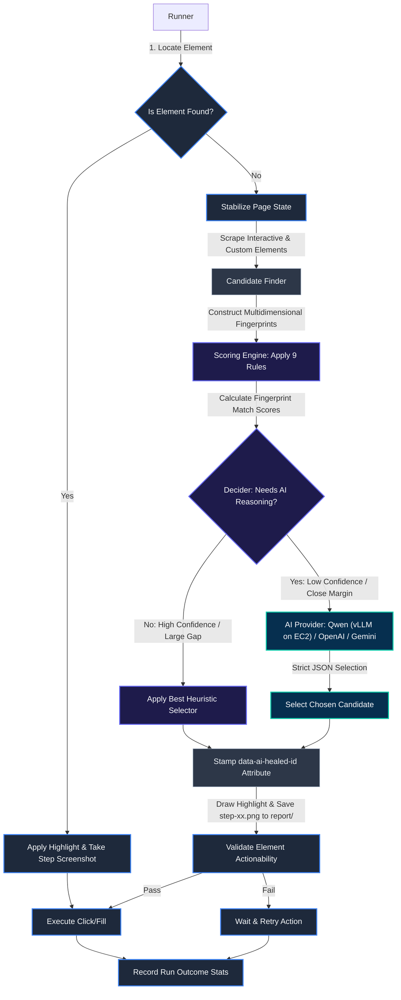
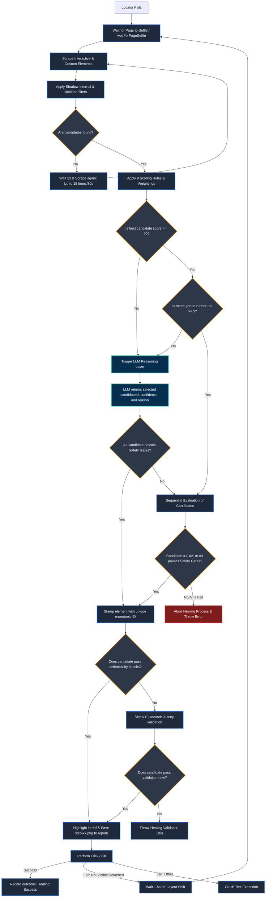
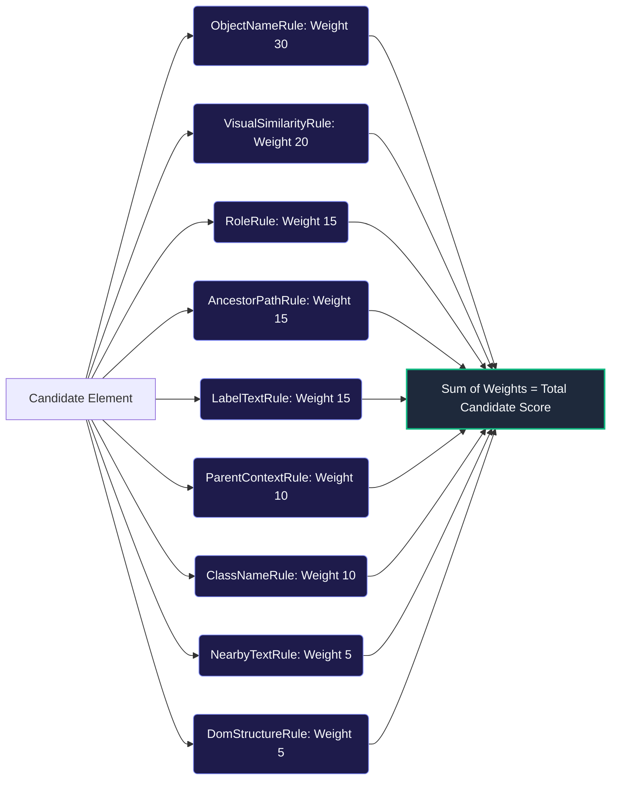
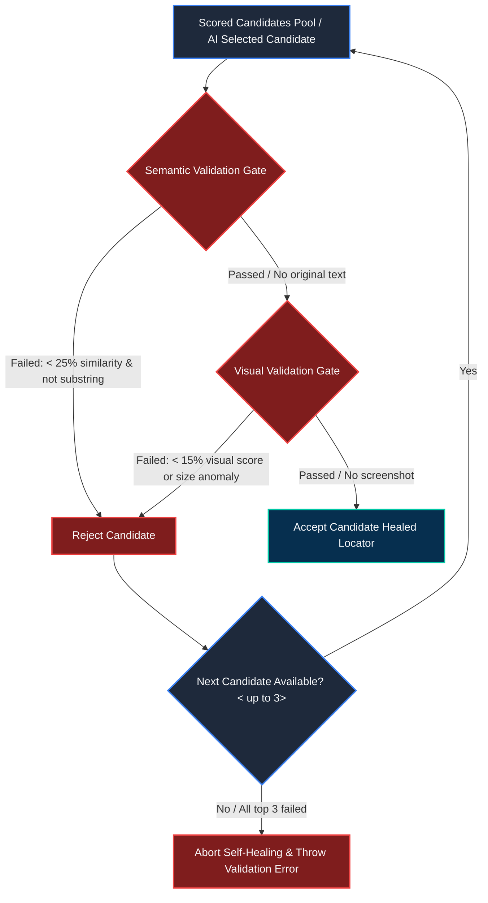
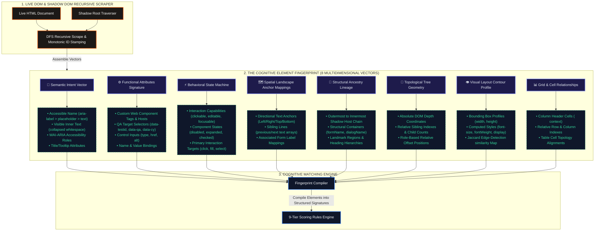
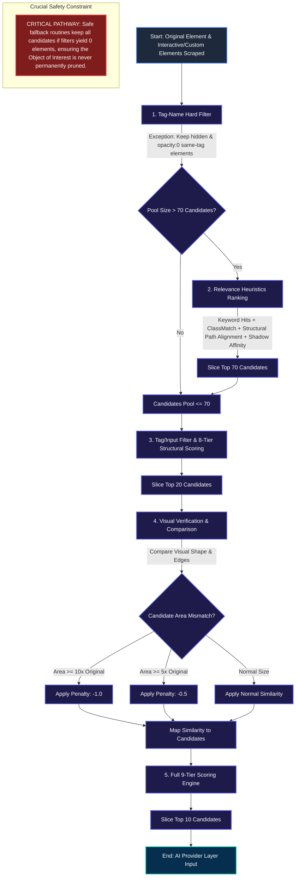

# RelocateAI: Architecture & Decision Flow Guide

**RelocateAI** is an intelligent self-healing system for web UI test automation. 

When a test automation script fails to find a web element (a click or text input locator breaks due to layout changes, styling shifts, or dynamic code updates), RelocateAI automatically intercepts the failure, scans the live page, constructs multi-dimensional element fingerprints, and dynamically heals the broken locator in real-time.

---

## 1. High-Level Architecture

RelocateAI operates as a **middle-layer orchestrator** between your test script and the web browser. When a script attempts an action on a locator that cannot be found, RelocateAI intercepts the failure and initiates the self-healing cycle.



---

## 2. Detailed Healing Decision Tree

The Orchestrator (`HealingEngine`) uses a hybrid model. It first calculates a **heuristic score** (0 to 100) using lightweight local math rules. If the local rules are highly confident and there is no ambiguity, it avoids calling expensive LLMs.

To handle dynamic, slow-loading Single Page Applications (SPAs) and frameworks, the candidate collection loop retries up to **15 times** (at 2-second intervals, allowing a maximum of **30 seconds**) if zero candidates are detected, ensuring that skeleton loadings have settled.

The flowchart below details the exact logical decisions made during a locator failure, highlighting how step screenshots are recorded:



---

## 3. The 9-Tier Scoring Pipeline

Before any LLM call is made, the **Scoring Engine** evaluates every single candidate element against **9 distinct metrics**. Each metric calculates a score (0.0 to 1.0) which is multiplied by the rule's weight.

### Candidate Pool Pruning (Top 10 Selection)
The orchestrator progressively filters candidate elements through a series of structural, heuristic, and visual stages to prune a raw DOM pool of hundreds down to the **top 10 candidates** (configurable via `AI_MAX_CANDIDATES` in the configuration) before passing them to the AI Reasoning Layer. This progressive pruning drastically reduces token consumption, cuts down API latency/cost, and prevents model confusion. For a detailed breakdown of the complete pruning pipeline, see [Section 5: The Candidate Pruning Pipeline](#5-the-candidate-pruning-pipeline-dom-to-10-candidates).


#### Detailed Breakdown of the 9 Rules

The rules are divided into **Heuristic String & Visual Rules** (which calculate similarity scores based on spatial and semantic dimensions) and **Direct Attribute Matches** (which verify structural alignment and tree geometry).

#### 1. Heuristic String & Visual Rules (Multidimensional Similarity Calculations)

*   **`ObjectNameRule` (Weight: 30)**
    *   **Mechanism**: Employs the **Normalized Levenshtein Edit Distance Algorithm** to perform cognitive textual alignment, matching candidate accessible names and labels against the original element name.

*   **`VisualSimilarityRule` (Weight: 20)**
    *   **Mechanism**: Employs a **Weighted Jaccard Similarity Algorithm on Box-Blurred Edge Maps** to analyze visual shape profiles and verify pixel-level edge contour alignment.

*   **`AncestorPathRule` (Weight: 15)**
    *   **Mechanism**: Employs the **Longest Common Subsequence (LCS) Algorithm** to align structural tag trajectories, verifying nested custom components and ancestral DOM hierarchies.

*   **`LabelTextRule` (Weight: 15)**
    *   **Mechanism**: Employs the **Levenshtein Distance Metric** to compute semantic context correlation between associated form labels and target inputs.

*   **`ClassNameRule` (Weight: 10)**
    *   **Mechanism**: Employs the **Jaccard Token Index Similarity Algorithm** to evaluate stylesheet signature tokens, ignoring dynamic framework class hashes.

*   **`NearbyTextRule` (Weight: 5)**
    *   **Mechanism**: Employs **Levenshtein String Distance & Substring Containment** to evaluate spatial textual neighborhood alignments.

---

#### 2. Direct Attribute Matches (Tree Geometry Comparisons)

*   **`RoleRule` (Weight: 15)**
    *   **Mechanism**: Employs **Direct String Equality & Set Membership Lookup** to match explicit HTML5 tags and accessibility roles.

*   **`ParentContextRule` (Weight: 10)**
    *   **Mechanism**: Employs **Direct String Equality Matchers** to align parent node tags and element IDs.

*   **`DomStructureRule` (Weight: 5)**
    *   **Mechanism**: Employs a **Numerical Difference Ratio Algorithm** to evaluate DOM tree coordinate depth and relative child indexing.

---

### Post-Scoring Safety Gates (The Pre-Action Validation Layer)

Once the scoring engine computes raw candidate scores (or the AI provider selects a target candidate ID), the Orchestrator runs candidate choices through a strict **Pre-Action Validation Layer** before confirming a healed locator.

This safety layer enforces a two-tier gate verification contract, preventing the engine from mismatching and clicking incorrect elements (e.g. clicking "Cancel" instead of "Save") if scores are inflated or dynamic layouts are ambiguous.



#### The Validation Gates

1. **Semantic Match Gate**
   * **Mechanism**: Verifies character-level accessible name overlap using Wagner-Fischer edit distance. 
   * **Failure Threshold**: Fails candidate if text similarity is **$< 25\%$** (unless one string is a direct substring of the other).
   * **Bypass**: If the original element has no text baseline coordinates, this gate is automatically bypassed.

2. **Visual Match Gate**
   * **Mechanism**: Compares cropped canvas edge contours against the original target screenshot using Jaccard edge-similarity mapping.
   * **Failure Threshold**: Fails candidate if visual edge similarity is **$< 15\%$** when original screenshot templates are present.
   * **Size Anomaly Protection**: Rejects layout wrappers automatically if similarity scores reflect size penalties (`-1.0` or `-0.5`).
   * **Bypass**: Bypasses the gate if screenshots are absent or if visual similarity evaluates to exactly `0` (the default/fallback value indicating a visual matching failure).

#### Sequential Fallback & Healing Aborts
* **AI Safe-check**: If the AI is used, its selection must pass the safety gates. If it fails, it is bypassed, and the engine falls back to heuristic candidates.
* **Top 3 Candidate Loop**: If the top candidate fails validation, the orchestrator logs a warning and evaluates the next best candidates sequentially (up to the top 3).
* **Hard Abort Exception**: If all top 3 candidate options fail safety validation gates, the orchestrator halts execution, logs a fatal error, and throws a validation exception to stop the test suite before performing incorrect clicks.

---

### 4. Element Identity Model (Fingerprinting)

Unlike traditional UI automation frameworks that rely strictly on brittle, static CSS selectors or absolute XPath strings—which fail immediately when layout restructures occur or when dynamic CSS-in-JS styling hashes rotate—**RelocateAI** models targets as a **Multi-Dimensional Cognitive Element Identity Signature (Fingerprint)**.

This fingerprint is built by recursively crawling the live DOM and traversing shadow boundaries, extracting parameters across **8 distinct categories**. Together, they form a robust, multi-dimensional signature that allows the matching engine to identify the target element even if its tag name, layout location, parent context, or style changes.



### Element Identity Dimensions
The following table outlines the parameters extracted for each dimension and how they protect the system against brittle UI changes:

| Identity Dimension | Parameters Used for Fingerprinting | Non-Traditional Advantages / Dynamic Safety |
| :--- | :--- | :--- |
| **1. Semantic Identity** | Computed accessible names, explicit & implicit ARIA roles, accessibility labels (`aria-label`, `aria-labelledby`, `aria-describedby`), and user-facing text descriptors (title and placeholder text). | Identifies elements based on user-visible meaning and intent, rendering matches resilient to absolute tag/styling alterations. |
| **2. Functional Identity** | Tag names (including custom custom element shadow hosts), custom test annotations (`data-testid`, `data-qa`, `data-cy`), input type controls, and reference targets (`href`). | Safely pierces layout wrappers to prioritize exact functional element bindings regardless of external page alterations. |
| **3. Behavioral Identity** | Focusability, clickability, editability, checkability, states (`disabled`, `readonly`, `checked`, `selected`, `expanded`), and primary interaction types (click/fill/check/select). | Ensures candidates are functionally compatible with the target test operation (e.g. verifying input boxes accept text typing). |
| **4. Component Tree Context** | Ordered parent-ancestor tag lineages, direct parent identities (IDs, tags), and the nested shadow host chain hierarchy. | Retains boundary affinity for custom component library elements (e.g. input fields nested inside specific table cell components). |
| **5. Spatial Neighborhood** | Relative siblings, adjacent sibling texts, associated HTML labels, and lines of text in the visual neighborhood. | Uses surrounding page copy as landmark coordinates to locate elements lacking unique inline attributes. |
| **6. Tree Geometry** | Absolute DOM depth coordinates (crossing shadow roots), child/sibling density counts, and child index offsets. | Resolves structural positions within repeating tables and lists. |
| **7. Visual Signature** | Layout bounding box dimensions, styling context (font sizes/weights), and visual layout characteristics. | Ensures candidates match the spatial outline and visual appearance of the original element screenshot. |
| **8. Grid Relationships** | Cell coordinates (row index, column index), table body structures, and column headers (`<th>`). | Matches target cells in dynamic lists using row-column relationships instead of brittle text anchors. |

### Visual Identity Signature Model
The diagram below illustrates the hierarchical categories and key-value properties that build the element's identity fingerprint:

### Element Fingerprint Schema Template
The complete JSON blueprint compiled for every element contains the following properties:

```json
{
  "semantic": {
    "text": "",
    "role": "",
    "accessibleName": "",
    "ariaLabel": "",
    "title": "",
    "placeholder": ""
  },
  "functional": {
    "normalizedText": "",
    "accessibleName": "",
    "role": "",
    "tagName": "",
    "ariaLabel": "",
    "ariaDescription": "",
    "ariaLabelledBy": "",
    "title": "",
    "placeholder": "",
    "name": "",
    "value": "",
    "href": "",
    "inputType": "",
    "dataTestId": "",
    "dataQa": "",
    "dataCy": "",
    "id": "",
    "alt": ""
  },
  "behavior": {
    "clickable": true,
    "editable": false,
    "selectable": false,
    "checkable": false,
    "focusable": true,
    "disabled": false,
    "readonly": false,
    "required": false,
    "interactionType": "",
    "checked": false,
    "selected": false,
    "expanded": false,
    "draggable": false
  },
  "ancestorContext": {
    "parentText": "",
    "parentRole": "",
    "ancestorText": [],
    "ancestorRoles": [],
    "ancestorTagNames": [],
    "containerText": "",
    "containerRole": "",
    "sectionName": "",
    "formName": "",
    "dialogName": "",
    "iframeName": "",
    "shadowHostName": ""
  },
  "neighborhood": {
    "previousText": "",
    "nextText": "",
    "leftText": "",
    "rightText": "",
    "topText": "",
    "bottomText": "",
    "siblings": [],
    "nearbyText": [],
    "nearbyRoles": [],
    "nearbyIcons": [],
    "closestLabel": "",
    "associatedLabel": ""
  },
  "structure": {
    "domDepth": 0,
    "childCount": 0,
    "siblingCount": 0,
    "containsText": true,
    "containsSvg": false,
    "containsImage": false,
    "containsInput": false,
    "subtreeTags": [],
    "parentTag": "",
    "indexInParent": 0,
    "positionAmongSameRole": 0
  },
  "visual": {
    "icon": "",
    "iconType": "",
    "iconText": "",
    "visible": true,
    "display": "",
    "shape": "",
    "group": "",
    "color": "",
    "fontSize": "",
    "fontWeight": "",
    "boundingWidth": 0,
    "boundingHeight": 0,
    "relativePosition": "",
    "zIndex": 0
  }
}
```

---

## 5. The Candidate Pruning Pipeline (DOM ➔ 10 Candidates)

To prevent sending massive DOM payloads to LLMs (which is slow, expensive, and leads to target element confusion or model hallucinations), **RelocateAI** runs a highly optimized, multi-tier candidate pruning pipeline. This pipeline converts the entire raw DOM (which can contain hundreds or thousands of elements) down to just the **top 10 potential candidates** for the AI reasoning layer.

### Crucial Objective: Retaining the Object of Interest
The most critical requirement of the pruning pipeline is **never to lose the Object of Interest (the target element)**. If the correct element is pruned at any stage, subsequent AI reasoning cannot recover it. Therefore, the pipeline uses safe fallbacks, lenient filters, and context bonuses to protect the target.



### Detailed Pipeline Stages

#### Stage 1: Scrape & Tag-Name Filter
- **Input**: The scraped interactive and custom elements, recursively collected from the web document and shadow roots.
- **Process**: Keeps only the elements that match the original tag name (`OrigTagName`, e.g., `INPUT`, `BUTTON`, or a custom component like `ZUI-SELECT-V3-17`).
- **Safety Exceptions**: 
  - **Hidden / Opacity 0 Elements**: If an element matches the target tag name, it is kept **even if it is hidden or has opacity: 0** (unlike other elements which are immediately discarded if invisible). This preserves lazy-loaded images, fading modals, or elements temporarily hidden by loading states.
  - **No-Match Fallback**: If zero candidates match the tag name (indicating a total framework/tag redesign), the filter is bypassed entirely to avoid losing the target.
  - **Slot Exception**: If the target tag is `"SLOT"`, the tag-name hard constraint is bypassed during collection and filtering since slots are non-interactive layout templates. Instead, candidates are filtered by the original shadow host tag names in the healing engine.

#### Stage 2: Relevance Cap (Pruning to 70 Candidates)
If the candidate pool is still larger than 70 elements, a lightweight keyword and structural matching algorithm ranks and prunes the pool:
1. **Keyword Overlap**: Matches words from `ObjectName`, `NearByText`, and `LocClassName`.
2. **Text Conciseness**: If a candidate contains the target text, it receives an extra bonus if it is a clean match (+30 points for near-exact length) to prevent large layout wrappers from outranking specific child elements.
3. **ClassMatch**: Rewards elements whose CSS classes match the original class structure, which is crucial for unlabeled dynamic icon buttons.
4. **Ancestor Path Alignment**: Compares up to 4 ancestors of the CSS selector to verify the component hierarchy.
5. **Shadow Host Chain Affinity**: Evaluates shadow host overlaps, ensuring that inputs nested inside the correct custom components are kept even if text hits are zero.
- **Result**: The pool is sliced down to the **top 70 candidates** based on their composite score.

#### Stage 3: 8-Tier Structural Scoring (Pruning to 20 Candidates)
- **Process**: The runner first restricts the candidate pool using tag-name and input-type filters (supporting shadow host matching for slots). Then, the Scoring Engine evaluates the filtered candidates using the **8 structural/attribute rules** (excluding the visual rule).
- **Result**: The pool is sorted by score, and the **top 20 candidates** are selected to advance to the next, more expensive stage.

#### Stage 4: Visual Similarity with Area Penalties
- **Process**: The top 20 candidates are scrolled into view sequentially, and compared visually against the original template.
- **Area-Based Penalties**:
  - If the candidate's area is **10 times or more** than the original element: visual similarity score is heavily penalized (-1.0).
  - If the candidate's area is **5 times or more** than the original element: visual similarity score is partially penalized (-0.5).
- **Result**: Highly similar but oversized layout wrappers are heavily penalized. The similarity scores are mapped back to the candidate objects.

#### Stage 5: Final Selection (Top 10 Candidates)
- **Process**: The Scoring Engine compiles the final scores using all **9 rules** (including the visual similarity score calculated in Stage 4).
- **Result**: The candidates are sorted, and the **top 10 candidates** are selected (configurable via `AI_MAX_CANDIDATES`).
- **AI Delivery**: If heuristics are insufficient (margin is low or score is below 90), these final 10 candidates, along with the original element details, are forwarded to the AI provider for strict JSON selection.

---

## 6. Key Components Glossary

| Component Name | Role in the System | Code Location |
| :--- | :--- | :--- |
| **`TestRunner`** | Coordinates execution. It loops over test steps, handles click/fill timeouts, invokes page-settle stabilization, draws highlights, captures step screenshots in the `report/` folder with the target element highlighted, validates actionability, and executes retries. | [`src/runner/test-runner.ts`](file:///c:/Users/shaam/Desktop/AIElementIdentification/src/runner/test-runner.ts) |
| **`CandidateFinder`** | Injected script that climbs shadow root nodes and slot boundaries recursively to find valid interactive targets. Stamps elements with unique monotonic IDs. | [`src/runner/candidate-finder.ts`](file:///c:/Users/shaam/Desktop/AIElementIdentification/src/runner/candidate-finder.ts) |
| **`ScoringEngine`** | The mathematical evaluator. It receives the raw candidate list and processes each candidate through the 9 rule-scoring components. | [`src/scoring/scoring.engine.ts`](file:///c:/Users/shaam/Desktop/AIElementIdentification/src/scoring/scoring.engine.ts) |
| **`HealingEngine`** | The brains. Orchestrates the decision matrix, filters candidates based on tag structure, runs pre-scoring, determines if LLM is required, and requests AI services. | [`src/healing/healing.engine.ts`](file:///c:/Users/shaam/Desktop/AIElementIdentification/src/healing/healing.engine.ts) |
| **`AI Services`** | Connects to standard APIs (OpenAI, Google Gemini, OpenRouter, vLLM) using strict structured output configurations to select the best candidate. | [`src/ai/`](file:///c:/Users/shaam/Desktop/AIElementIdentification/src/ai/) |
| **`ElementValidator`** | Runs actionability tests (`isVisible`, `isEnabled`, `isEditable`) on healed locators to ensure they are clickable before execution proceeds. | [`src/runner/element-validator.ts`](file:///c:/Users/shaam/Desktop/AIElementIdentification/src/runner/element-validator.ts) |
| **`SafetyValidator`** & **`ValidationGates`** | Implements the OOP pre-action safety validation layer. Validates candidate text similarity (Semantic) and shape/edge similarity (Visual) to prevent clicking wrong elements. | [`src/healing/validation/safety.validator.ts`](file:///c:/Users/shaam/Desktop/AIElementIdentification/src/healing/validation/safety.validator.ts) |
